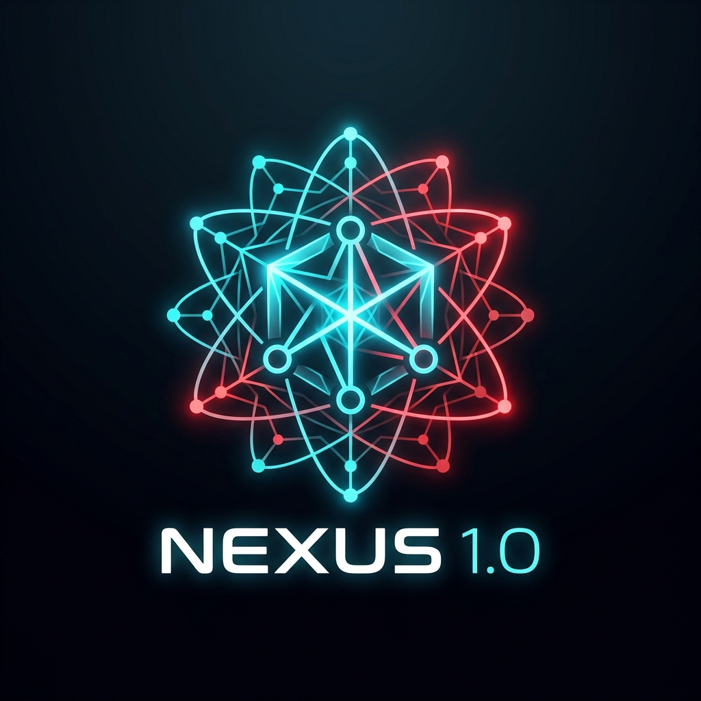

<div align="center">



# NEXUS 1.0
**A Secure, Local & Cloud Hybrid Multi-Agent AI Platform**

*Zero data leaves your machine unless you choose to. Multiple AI models collaborate to solve your tasks.*

</div>

---

## What is NEXUS 1.0?

**NEXUS 1.0** is an intelligent AI workspace that runs on your computer. Instead of asking just one AI model to do a job, NEXUS uses **multiple specialized AI models** that work together in a structured pipeline. They talk to each other, write answers, criticize each other, and merge their strengths to produce a single perfect result for you.

You can run NEXUS completely **offline and privately** using local models, or securely unlock next-generation **Google Gemini cloud models** by signing in with Google!

---

## Beautiful New Features We Added

### 1. Retro-Futuristic Login Portal
- Access the platform securely. On startup, a beautiful login gate welcomes you to sign in with your Google account.
- Displays your authenticated Google avatar and name in a sleek status chip at the top of the workspace.

### 2. Next-Generation Gemini 3.5+ Models
- Native support for **Gemini 3.5 Flash**, **Gemini 3.5 Pro**, and **Gemini 3.0 Flash** online models.
- These cloud models collaborate seamlessly in hybrid pipelines alongside your local GGUF models.

### 3. Circular Quality Scoring & Specialist Tabs
- Displays a beautiful glowing radial progress circle tracking the AI quality score.
- **Tabs Interface**:
  - **FINAL OUT**: View clean, copyable, syntax-highlighted code blocks or written results.
  - **ARCHITECT**: View the vertical step-by-step deconstructed blueprint and priority levels.
  - **SPECIALISTS**: Open a side-by-side comparison screen to read the raw outputs generated by each specialist model.
  - **CRITIC & VOTES**: Review the individual score reviews and consensus rankings.

### 4. Interactive Chat & Follow-ups
- Speak continuously with the agent team! At the bottom of any completed report, a chat box lets you ask follow-up questions (e.g. "optimize this script", "write it in Rust") to refine the output recursively.

### 5. Encrypted Offline Persistence
- Every task, subtask, and log is automatically encrypted with AES-256-GCM using keys derived from your device.
- Task histories survive application restarts, and you can erase everything instantly on command using the **SECURE WIPE** option.

---

## The 5-Agent Collaboration Flow

When you submit a task, NEXUS deploys a collaborative squad:

```
[ Your Prompt ]
       │
       ▼
1. ARCHITECT (Qwen) ── Deconstructs prompt into structured subtasks.
       │
       ▼
2. SPECIALISTS (Llama, Gemini 3.5, Phi) ── Execute subtasks independently.
       │
       ▼
3. CRITIC (Gemini 3.5 Pro) ── Rigorously scores and critiques outputs.
       │
       ▼
4. CONSENSUS (Gemini 3.5 Pro) ── Ranks responses and votes on the best foundation.
       │
       ▼
5. SYNTHESIZER (Gemini 3.5 Flash) ── Merges strengths into a single master answer.
       │
       ▼
[ Final Verified Result ]
```

---

## How to Get Started

### 1. Set Up Dependencies
Make sure you have Node.js installed on your computer.

```bash
# Clone the repository
cd NEXUS-1.0

# Install package dependencies
npm install
```

### 2. Launch the Platform
Start the local development server to run it in your browser immediately:

```bash
npm run dev
```

Open your browser and visit: **[http://localhost:5173/](http://localhost:5173/)**

---

## Running Offline via Local Ollama
To accelerate inference locally using your GPU, download and launch [Ollama](https://ollama.com/), then pull your favorite model tags:

```bash
ollama run qwen2.5:latest
ollama run llama3.2:latest
ollama run phi3.5:latest
```

NEXUS will automatically detect Ollama running on `localhost:11434` and route local tasks to it at lightning speeds!

---

<div align="center">

**All local data remains secure and encrypted. Zero cloud telemetry. Complete privacy.**

</div>
